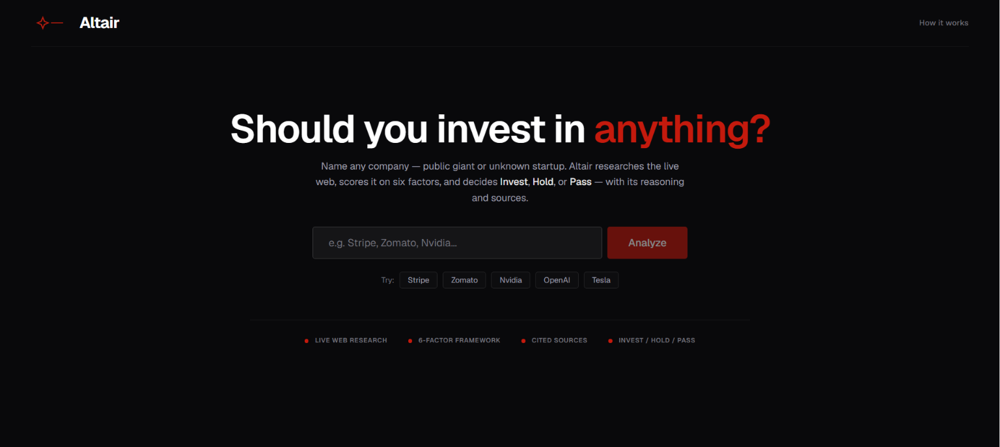
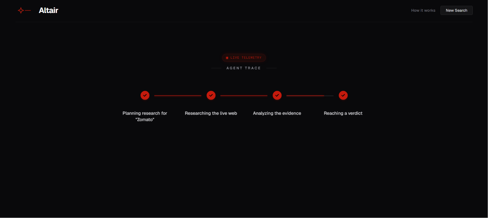
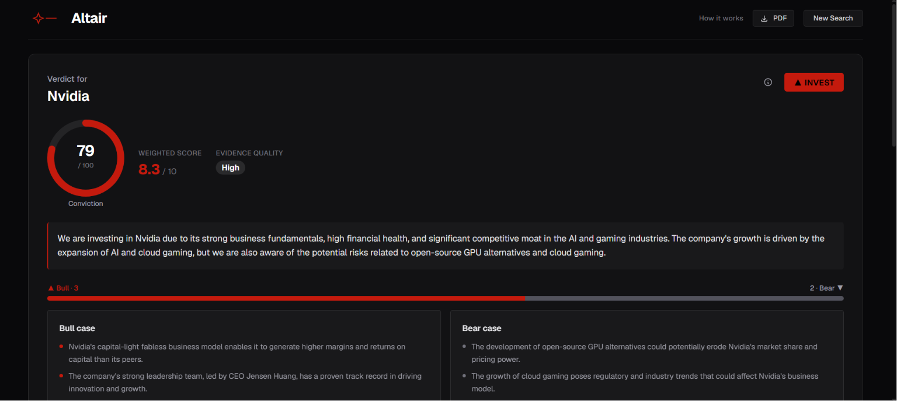
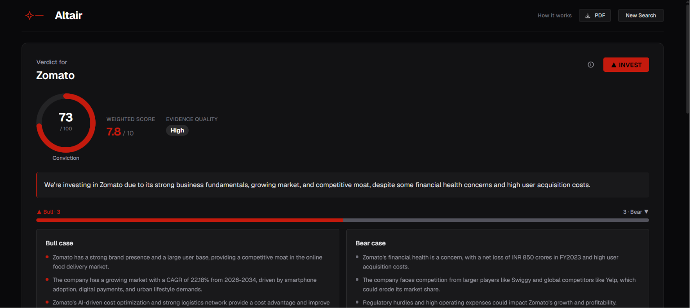
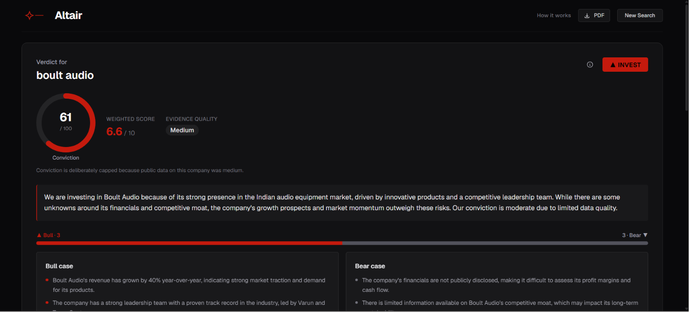

# Altair — AI Investment Research Agent

> Name any company — a public giant or an unknown startup — and Altair researches the live web,
> scores it on a fixed 6‑factor framework, and returns a clear **Invest / Hold / Pass** verdict
> with its reasoning, a confidence level, and **every source cited**.

Built for the **InsideIIM × AltUni AI Labs** — AI Product Development Engineer (Intern) take‑home.

**Stack:** Next.js (App Router) · React · TypeScript · **LangGraph.js** · Groq (Llama) · Tavily · Tailwind

🔗 **Live demo:** **https://investment-research-agent-virid.vercel.app**

---

## 1. Overview — what it does

Altair is an autonomous research **agent**, not a chatbot. You give it a company name and it:

1. **Plans** what to research (adapting to whether the company is a famous public name or an obscure startup).
2. **Researches** the live web and gathers **real, citable sources**.
3. **Analyzes** the evidence across **six weighted factors**, scoring each 0–10 and judging how trustworthy the evidence is.
4. **Decides** — a transparent weighted‑score rule produces **INVEST / HOLD / PASS**, with a 0–100 conviction.

It streams the whole thing live, so you watch the agent **plan → research → analyze → decide** in real time, then land on a dashboard with a conviction gauge, a radar chart of the six factors, a bull‑vs‑bear breakdown, and the list of sources you can click to verify.

**What makes it more than a generic LLM wrapper**
- **Decide, don't dump** — it commits to a verdict + reasoning, instead of a wall of text.
- **Cited & verifiable** — every claim traces back to a real source shown in the UI.
- **Honest about uncertainty** — for companies with little public data, it *says so* and **caps its confidence** instead of bluffing.
- **Works for any company size** — a reflect‑and‑retry loop gives small/unlisted startups a fair shot.
- **Transparent decision** — the Invest/Hold/Pass call is a deterministic rule you can point to, not a black‑box LLM whim.

---

## 2. How to run it

### Prerequisites
- **Node.js 18.18+** (developed on Node 24)
- Two free API keys (no credit card required):
  - **Groq** — the LLM. Create one at <https://console.groq.com/keys> (starts with `gsk_`)
  - **Tavily** — web search. Create one at <https://app.tavily.com> (starts with `tvly-`)

### Setup
```bash
# 1. Install dependencies
npm install

# 2. Create your local env file from the template
cp .env.example .env.local
```

Open `.env.local` and fill in your keys:
```bash
GROQ_API_KEY=gsk_your_key_here
TAVILY_API_KEY=tvly_your_key_here

# Optional model overrides (see "Key decisions" below):
# GROQ_REASONING_MODEL=llama-3.3-70b-versatile   # analysis (quality)
# GROQ_FAST_MODEL=llama-3.1-8b-instant           # planning / narrative
```

### Run
```bash
npm run dev        # dev server → http://localhost:3000
# or
npm run build && npm start   # production build
```

Open **http://localhost:3000**, type a company (or click an example), and hit **Analyze**. A full run takes ~20–40 seconds (it's doing several live web searches + multi‑step LLM reasoning).

> **Note on free tiers:** Groq's free tier has per‑minute and per‑day token limits. The app handles these gracefully (it shows a clear message and auto‑retries transient limits). If you hit the daily cap from heavy testing, wait for it to reset or use a fresh Groq account. Each Groq model has its **own** daily bucket, so you can also set `GROQ_REASONING_MODEL=llama-3.1-8b-instant` to keep running on a fresh bucket.

---

## 3. How it works — approach & architecture

### The agent: a LangGraph state machine
The core is a **LangGraph.js** graph (`lib/agent/graph.ts`) — a state machine, not a linear chain, so every step is explicit, inspectable, and streamable:

```
            ┌─────────────── reflect & retry (if data is thin) ───────────────┐
            │                                                                  ▼
  START ─▶ Plan ─▶ Research ─▶ Analyze ─▶ (dataQuality "low" & not deepened?) ─▶ Deepen ─┐
                                   │                                                      │
                                   └────────────── else ──────────────▶ Decide ─▶ END    │
                                                                          ▲               │
                                                                          └── re-analyze ─┘
```

| Node | Job | Model |
|------|-----|-------|
| **Plan** | Turn the company name into 4–6 targeted, searchable questions; adapts for small/obscure names (founders, funding, reviews) | Llama 3.1 8B |
| **Research** | Run the questions through **Tavily** web search concurrently; collect real sources `{title, url, content, score}` | — |
| **Analyze** | Score the company **0–10 on each of the 6 fixed factors**, with an evidence‑based rationale; rate `dataQuality` honestly | Llama 3.3 70B |
| **Deepen** *(conditional)* | If the analyst judged the data **low** quality, re‑research with broader queries, then re‑analyze — a reflect‑and‑retry loop | — |
| **Decide** | The narrative (thesis, bull/bear, risks); the *decision itself* is computed in code | Llama 3.1 8B |

Every node emits typed progress events (`lib/agent/events.ts`) through LangGraph's stream writer.

### The decision is a transparent rule, not an LLM whim
The 6 factors and their weights live in **code** (`lib/agent/framework.ts`), not in the model's hands:

| Factor | Weight | What it looks at |
|--------|:------:|------------------|
| Business Fundamentals | 1.0 | what it does, business model, revenue mix, customer concentration |
| **Financial Health** | **1.2** | growth, margins, cash flow, debt, liquidity, trends |
| Competitive Moat | 1.1 | market share, brand, switching costs, network effects, IP |
| Industry & Macro | 0.9 | industry growth, regulation, disruption, cycle sensitivity |
| Management & Governance | 0.8 | leadership, insider ownership, capital allocation, red flags |
| Growth Catalysts & Risks | 1.0 | upside drivers vs. downside risks |

1. The LLM **scores** each factor from the evidence.
2. A **weighted average** → a single composite (0–10).
3. **Threshold rule:** `≥ 6.5 → INVEST · ≥ 4.5 → HOLD · else PASS`.
4. **Conviction** is sized by how decisive the score is, then **hard‑capped by data quality** (`low → 45, medium → 72, high → 95`) — so the agent is never falsely confident about a company it could barely research.

This means the actual call is explainable math; the LLM only handles language and scoring.

### Enforcing structured output (controlling the LLM)
- **Zod schemas** (`lib/agent/schemas.ts`) define every structured output. Factor names are a Zod **enum** locked to the six categories — the model can't invent a 7th or rename one.
- Outputs run through `withStructuredOutput(schema, { method: "jsonMode" })` + a JSON‑schema hint injected into the prompt (`lib/agent/structured.ts`), then are **Zod‑validated**. Shape is guaranteed at the parse layer, not hoped for. (JSON mode was chosen over function‑calling because Llama‑on‑Groq returned `tool_use_failed` on the function‑call envelope.)
- **Reproducibility:** plan + analyze run at **temperature 0**, so the same evidence yields the same scores and a stable verdict.

### Streaming UI
- `app/api/research/route.ts` runs the graph and streams each event to the browser as **Server‑Sent Events (SSE)**.
- `app/hooks/useResearchAgent.ts` consumes the stream and folds events into one React state via a pure reducer — driving the live **Agent Trace**, then the dashboard (`VerdictCard`, `ScoreRadar`, `ConvictionGauge`, `Dimensions`, `Sources`). All charts are **hand‑built SVG** (no chart library), so the bundle stays light.

### Project structure
```
investment-research-agent/
├─ app/
│  ├─ api/research/route.ts        # streaming SSE endpoint (runs the agent)
│  ├─ hooks/useResearchAgent.ts    # client SSE consumer + reducer
│  ├─ components/                  # VerdictCard, ScoreRadar, ConvictionGauge, Dimensions,
│  │                               #   AgentTrace, Sources, HowItWorks, EvidenceDrawer, PrintReport
│  ├─ page.tsx · layout.tsx · globals.css
├─ lib/agent/
│  ├─ graph.ts        # LangGraph: Plan → Research → Analyze → (Deepen) → Decide
│  ├─ framework.ts    # 6 weighted factors + compositeScore + deriveVerdict (the decision rule)
│  ├─ schemas.ts      # Zod schemas + types
│  ├─ llm.ts          # Groq model factory (env-configurable)
│  ├─ search.ts       # Tavily web-search wrapper (degrades gracefully)
│  ├─ structured.ts   # JSON-mode structured-output helper
│  ├─ state.ts        # LangGraph state annotation
│  └─ events.ts       # typed trace events (SSE)
└─ .env.example
```

---

## 4. Key decisions & trade‑offs

| Decision | Why | Trade‑off / what I left out |
|----------|-----|------------------------------|
| **LangGraph state machine** (vs. a single prompt or linear chain) | Explicit, inspectable, streamable steps; each node has one job → controllable structured output | More moving parts than a one‑shot prompt |
| **Groq + Llama** as the LLM | Free, fast, strong reasoning; keeps us inside the required LangChain.js ecosystem (`ChatGroq`) | Free‑tier rate limits (handled gracefully) |
| **Tavily web search** (vs. a financial‑data API) | Input is a free‑text **company name** — could be private/non‑US. A stock API returns nothing for most; web search covers **any** company + the qualitative signal that drives a thesis, with citations | Returns snippets, not full filings; depends on an external service |
| **Cover small/obscure companies** | Most agents only work on famous names whose data is easy. A financial API would fail exactly the companies that need research | Built adaptive planning + a reflect‑and‑retry deepen loop instead of relying on structured feeds |
| **Decision = deterministic weighted rule** | The Invest/Hold/Pass call is explainable math (weights → threshold), not an LLM's mood; the LLM only scores + writes prose | A linear weighted model is simpler than real investing (a future model could let the LLM override with justification) |
| **Honest uncertainty (data‑quality conviction cap)** | An investment tool must never sound more certain than the data allows; a no‑data company gets an honest PASS at low conviction, not a hallucination | — |
| **Temperature 0 for scoring** | Same company → same verdict (reproducibility), instead of flipping across a threshold between runs | Live web data can still change over time (legitimately); Groq isn't bit‑deterministic |
| **Hand‑built SVG charts** (no chart lib) | Small bundle, full control, fast on Vercel | More component code |
| **Valuation multiples & ownership/short‑interest folded in / deferred** | They need market‑data feeds that don't exist for the small private companies we deliberately support | Best‑effort within Financial Health; documented limitation |

---

## 5. Example runs

> Screenshots live in [`screenshots/`](screenshots). Representative outputs — live web data means exact numbers vary slightly between runs.

### The interface
| Landing | Live agent trace |
|---|---|
|  |  |

### 🟢 Nvidia → INVEST · high conviction · evidence: high


Strong moat (CUDA + ecosystem), excellent financials, dominant position in the AI/GPU market. Bull: data‑center growth, software moat, partnerships. Bear: competition (AMD/Intel), customer concentration, regulatory/supply‑chain risk.

### 🟢 Zomato (Eternal Ltd) → INVEST · moderate conviction · evidence: medium–high


Strong brand and large user base in a growing market; expansion into quick‑commerce. Surfaced the company's **own investor‑relations PDFs** and Moneycontrol as sources. Bear: profitability questions, regulatory risk, competition.

### 🟡 Boult Audio (small Indian startup) → INVEST · conviction capped (medium data)


Impressive revenue growth and a clear product niche, but limited public data on margins/cash flow → conviction is **deliberately tempered**, and the verdict *says so*.

### 🔴 Zentary Microsystems (deliberately obscure / near‑unknown) → PASS · low conviction


First research pass returned little → the analyst rated data **low** → the **deepen loop fired** ("Limited public data — digging deeper") → still thin → honest **PASS** with the thesis: *"passing because the available data does not provide a clear picture … this is the absence of compelling evidence, not the presence of negative evidence."* — i.e. it refused to fabricate a confident verdict.

---

## 6. What I would improve with more time

- **Groundedness verification** — a verifier node (LLM‑as‑judge / NLI) that checks each rationale against its sources and discards unsupported claims; **per‑factor citation enforcement** (`evidenceRefs`) and an explicit **"INSUFFICIENT DATA" abstention** when coverage is too low.
- **Source quality & paywalls** — rank by domain authority, prefer **free primary sources** (SEC EDGAR filings, investor‑relations pages, earnings transcripts) over paywalled journalism, **license** (not scrape) Bloomberg/Refinitiv‑grade feeds, and filter paywall/blocked stubs so empty content never counts as evidence.
- **Stream partial structured data** — render the radar **dimension‑by‑dimension** and typewriter the rationales as the LLM generates (via `streamObject` / partial‑JSON parsing) so the ~30s analyze step feels alive instead of "stuck."
- **Production‑grade streaming resilience** — decouple the run from the HTTP connection: a durable worker + **LangGraph checkpointer**, a persisted per‑run event log, and a **resumable subscription** (SSE `Last‑Event‑ID` replay) so a dropped mobile connection loses nothing.
- **Richer analysis** — a dedicated valuation lens for public companies (real P/E, EV/EBITDA via a financial API), peer benchmarking, and a "borderline" label for genuine coin‑flip companies.
- **Evals & observability** — trace every `evidence → score → rationale` to LangSmith/Langfuse and run an offline groundedness/hallucination eval set in CI.

---

## 7. BONUS — build transcript & LLM session logs

This project was built in a pair‑programming session with an LLM (Claude, via Claude Code), used as a reasoning aid — and **every decision is one the author can explain and defend.** The complete, running session log lives in:

- **[`docs/BUILD_TRANSCRIPT.md`](docs/BUILD_TRANSCRIPT.md)** — the full turn‑by‑turn build transcript (framing → company research → architecture → build → bug fixes → polish).
- **[`docs/DECISIONS_AND_AMBIGUITIES.md`](docs/DECISIONS_AND_AMBIGUITIES.md)** — every key decision, trade‑off, and ambiguity call with its reasoning.
- **[`docs/PRODUCT_PRINCIPLES.md`](docs/PRODUCT_PRINCIPLES.md)** — the InsideIIM/Ayana product principles the design follows.

---

## Tech stack

**Next.js** (App Router) · **React** · **TypeScript** · **LangGraph.js** + **LangChain core** · **Groq** (`ChatGroq`, Llama 3.3 70B / 3.1 8B) · **Tavily** (web search) · **Zod** (structured output) · **Tailwind CSS** · **Framer Motion** · hand‑built **SVG** charts.

> Built solo for the InsideIIM × AltUni AI Labs assignment. Remember to **rotate your API keys** before sharing the repo publicly.
